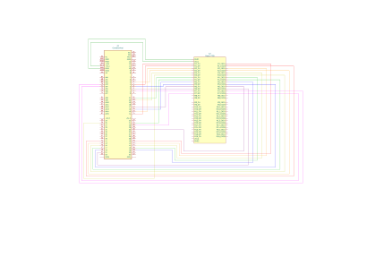

# batbot7_tendon_controller

This directory contains the embedded code for the tendon motor controller application.

## Hardware

Requirements: 

- Adafruit Grand Central
- 8x Pololu DRV8835 Motor Controllers (https://www.pololu.com/product/2135)

The connection diagram for the Adafruit Grand Central with the motor PCB is shown in the image below (obviously, if a NEEC motor shield is available, then this is unecessary):

Below is the pin assignments in a tabular format:

[TODO]

The DRV8335 motor drivers must also be connected and headers to the available headers as shown in the image below:

[TODO]

Due to limited pin capacities, a single Adafruit Grand Central is capable of controlling only motors 1-8, so a second grand central must be used to control motors 9-16. The pin assignments are similar, except starting at motor 9. For reference, below are the pin assignments in tabular format.

[TODO]

Motors are connected to the header section labeled Motors 1-8 (or 9-16) Input and Output. The motors must be connected as shown in the image below.

[TODO]

Lastly, the motor shield must be supplied a +6V power source. Seperate power terminals are available corresponding to Motors 1-8 and 9-16, respectively.

## Running the Application

The tendon control application is designed to receive motor commands from a base computer. The tendon controller is capable of communicating with the host computer through the following serial interfaces:

- SPI
- UART

This repository ships with 2 GUI applications (located in the batbot7_bringup directory) to interface with the tendon controller:

- bb_gui.py - Also contains sonar and GPS interfaces/
- pinnae.py - Standalone motor control GUI

Additionally, the PinnaeController.py exposes a Python API for interfacing with the tendon controller.